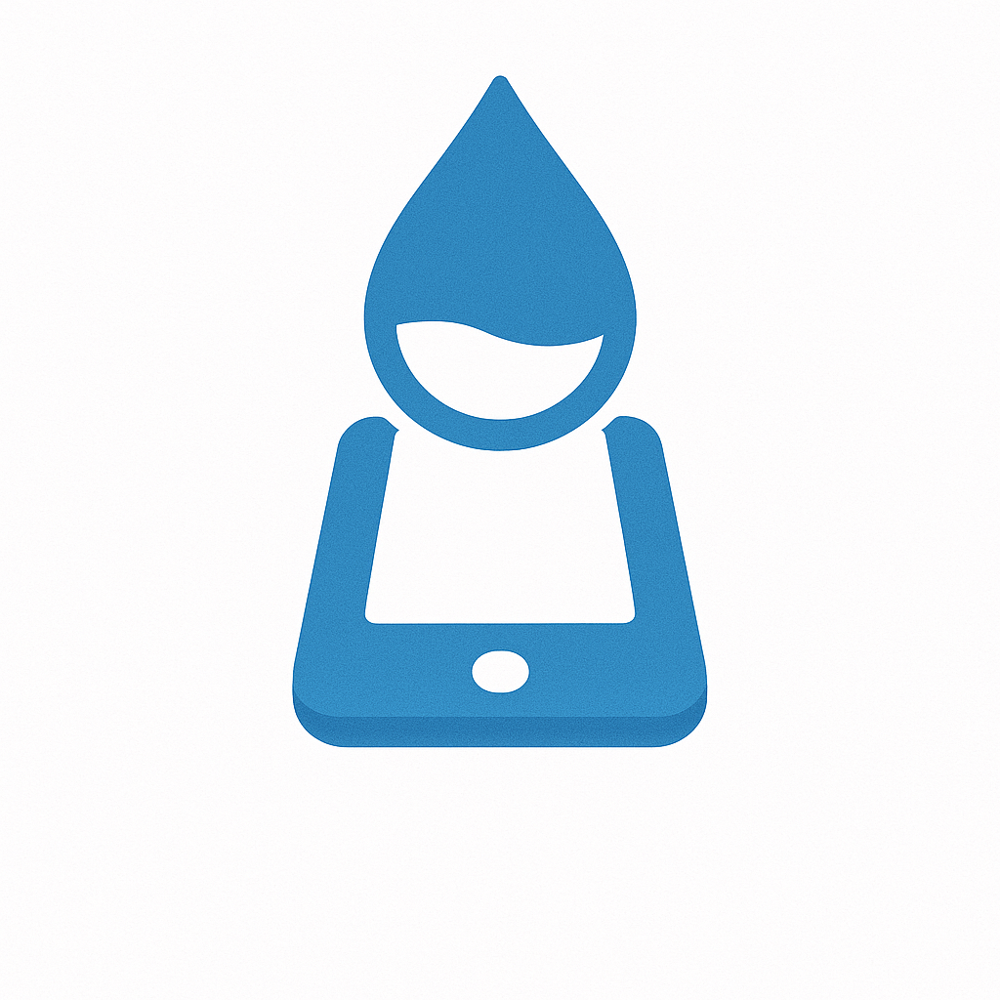

# Water Counter

Track your daily water intake with a simple interface.

## Features

- Track daily water intake in ml
- Customizable daily goal
- View last 7 days history with chart
- Quick add presets (250ml, 500ml, 750ml, 1000ml)
- Custom amount input
- Widgets

## Widgets

Two widget types available:

1. **Display Widget**: Shows today's intake and progress bar
2. **Quick Action Widget**: Tap to add 250ml instantly

## Installation

```bash
npm install
```

### iOS

```bash
npx expo run:ios
```

### Android

```bash
npx expo run:android
```